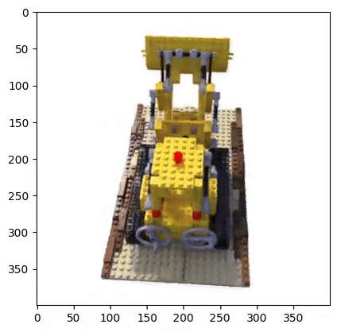
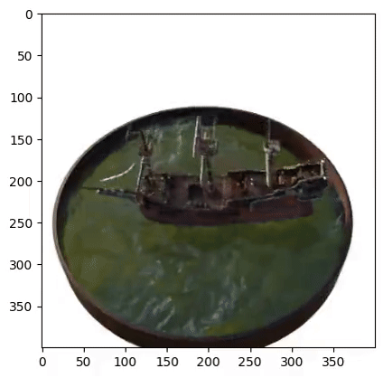

#  Neural Radiance Fields (NeRF)

## Overview

| **NeRF Results Overview** |  |
|----------|----------|
|  |  |
| Lego Output |   Lego Output without positional encoding |
|  | |
| Ship Output | |

This repository contains an implementation of a Neural Radiance Fields (NeRF) model for volumetric rendering using PyTorch. NeRF is a powerful technique for synthesizing novel views of a scene by learning a continuous representation of scene geometry and appearance from a set of images. This implementation includes training, validation, testing, and visualization functionalities for NeRF models.

## Table of Contents

- [Overview](#overview)
- [Requirements](#requirements)
- [Usage](#usage)
- [Results](#results)
- [Acknowledgement](#acknowledgement)
  
## Requirements

To run this script, you need Python 3 and the following Python packages:
- `Numpy`
- `Opencv-python`
- `SciKit-Image`
- `PyTorch`
- `Imageio`
- `Tqdm`
- `Matplotlib`
- `Moviepy`
- `Torchvision`

You can install these packages using pip:

```bash
pip install numpy opencv-python scikit-image torch tqdm matplotlib torchvision moviepy imageio
```

## Usage
1. Clone the repository:

```bash
git clone https://github.com/anujjagetia5/Neural-Radiance-Field.git
cd NeRF-View-Synthesis-main
```

2. To train the NeRF model and generate results, run the following command:

```bash
python Wrapper.py --epoch 16 --lr_initial 5e-4 --lr_final 5e-5 --L_x 10 --L_d 4 --hn 2 --hf 6 --fine 128 --course 64 --basedir data/lego --checkpoint_dir Checkpoints --output_dir Pred_test_output
```
#### Training Script Arguments (`Wrapper.py`)  

- `--epoch`: Number of epochs for training (default: 16).  
- `--lr_initial`: Initial learning rate (default: 5e-4).  
- `--lr_final`: Final learning rate (default: 5e-5).  
- `--L_x`: Parameter `L_x` for positional encoding in the NeRF model (default: 10).  
- `--L_d`: Parameter `L_d` for positional encoding in the NeRF model (default: 4).  
- `--hn`: Near bound for NeRF model volumetric rendering (default: 2).  
- `--hf`: Far bound for NeRF model volumetric rendering (default: 6).  
- `--fine`: Number of fine sampling points (default: 128).  
- `--course`: Number of coarse sampling points (default: 64).  
- `--basedir`: Base directory containing the dataset (default: `data/lego`).  
- `--checkpoint_dir`: Directory to save model checkpoints (default: `Checkpoints`).  
- `--output_dir`: Directory to save test predictions (default: `Pred_test_output`).  

3. Running the above script gives output video(gif) as a result. The output video(gif) generated by the script is in MPEG-4 format, even though the file extension is .mp4. Sometimes, the video may not run directly on a laptop or media player. You may need to play it with VLC mdedia player or convert it to the .mp4 format.

4. For getting the MSE loss, PSNR value and SSIM value for test set, run the `Test_set_loss.py` file. 

```bash
python Test_set_loss.py --input_folder data/lego/test --output_folder lego/novel_views_org_final 
```

#### Test Set Loss Script Arguments (`Test_set_loss.py`)  

- `--input_folder`: Path to the folder containing original test set images.  
- `--output_folder`: Path to the folder containing output test set images.  

## Results
The results of the training process, including PSNR, SSIM, and MSE loss plots, will be saved in the specified `checkpoint_dir`. Additionally, the rendered images and a video of the synthesized views will be saved in the specified `output_dir`.

## Acknowledgement
This implementation is based on the NeRF: Representing Scenes as Neural Radiance Fields for View Synthesis by B. Mildenhall, P. P. Srinivasan, M. Tancik, J. T. Barron, R. Ramamoorthi, and R. Ng.
